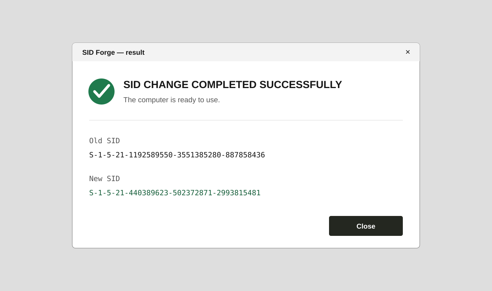
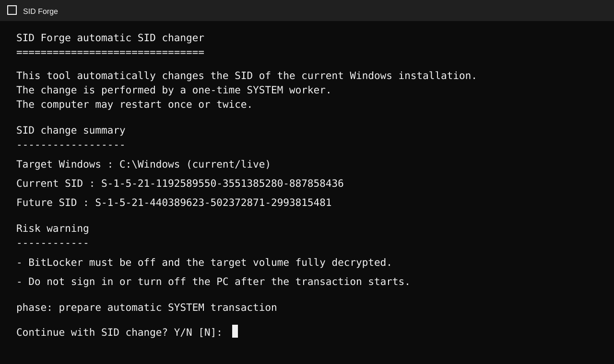
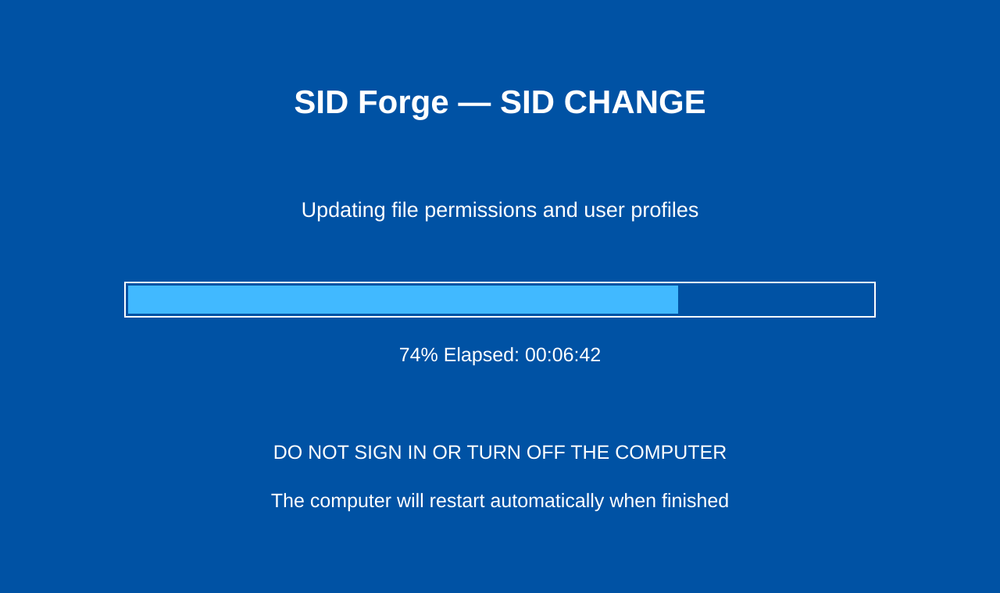

# SID Forge

SID Forge is a Windows utility for controlled local Machine SID changes on cloned, restored, or redeployed computers.

It guides the operator through inspection, account-bound authorization, restart, progress, verification, and a clear result showing whether the operation completed successfully.

[Official website](https://sidforge.pp.ua/) · [Download](https://sidforge.pp.ua/download/sid-forge/stable) · [Pricing](https://sidforge.pp.ua/pricing) · [Support](mailto:support@sidforge.pp.ua)

## Why administrators use SID Forge

- Change a local Windows Machine SID without rebuilding an already configured PC.
- Preserve local profiles and installed applications during the supported workflow.
- See the current and proposed SID before confirming the operation.
- Follow visible progress during the privileged stage.
- Receive a separate result after restart with the previous SID, new SID, or an actionable error.
- Use automatic rollback readiness for critical transaction failures.

## Typical use cases

- A Windows workstation restored from a master image.
- A virtual machine cloned from an existing installation.
- A configured PC moved to replacement hardware.
- A repair or deployment workflow that requires a new local Machine SID.

Changing a Machine SID is not a universal repair for networking, domain trust, WSUS, activation, or application-specific identifiers. Diagnose the actual issue and create a tested backup before any system-identity operation.

## How it works for the operator

1. Download the current `SIDForge.exe` from the official website.
2. Start SID Forge with administrator approval.
3. Review the current SID, proposed SID, warnings, and preparation status.
4. Authorize the request through the SID Forge account flow.
5. Allow the computer to restart and finish the protected stage without interruption.
6. Read the result shown after sign-in.

## Licensing and promotions

SID Forge supports single operations, operation packs, and time-based access. Available plans are shown on the [official pricing page](https://sidforge.pp.ua/pricing).

Promotional codes may provide a limited number of SID changes, devices, or access time. The exact allowance and expiration are displayed in the customer account when a valid promotion is applied.

## Documentation

- [Getting started](docs/GETTING-STARTED.md)
- [Use cases and limitations](docs/USE-CASES.md)
- [Promotions and licensing](docs/PROMOTIONS.md)
- [Verify an official download](docs/VERIFY-DOWNLOAD.md)
- [Support and diagnostics](SUPPORT.md)
- [Security policy](SECURITY.md)

## Important repository notice

This repository contains public documentation and product images only. It does **not** contain SID Forge source code, private implementation details, signing material, service credentials, license secrets, or internal infrastructure configuration.

---

## Українською

SID Forge — програма для контрольованої зміни локального Machine SID на клонованих, відновлених або повторно розгорнутих Windows-комп’ютерах.

Програма показує поточний і майбутній SID, проводить користувача через підтвердження, перезавантаження та захищений етап, а після входу показує окремий результат зі старим SID, новим SID або зрозумілою помилкою.

[Офіційний сайт](https://sidforge.pp.ua/) · [Завантажити](https://sidforge.pp.ua/download/sid-forge/stable) · [Ціни](https://sidforge.pp.ua/pricing) · [Підтримка](mailto:support@sidforge.pp.ua)

Репозиторій містить лише публічну документацію та зображення продукту. Вихідного коду, внутрішньої реалізації, ключів, секретів та конфігурації інфраструктури тут немає.
